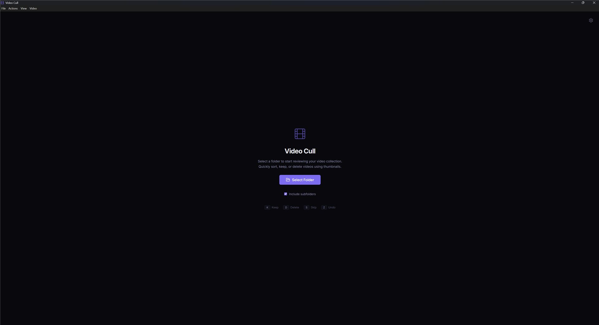
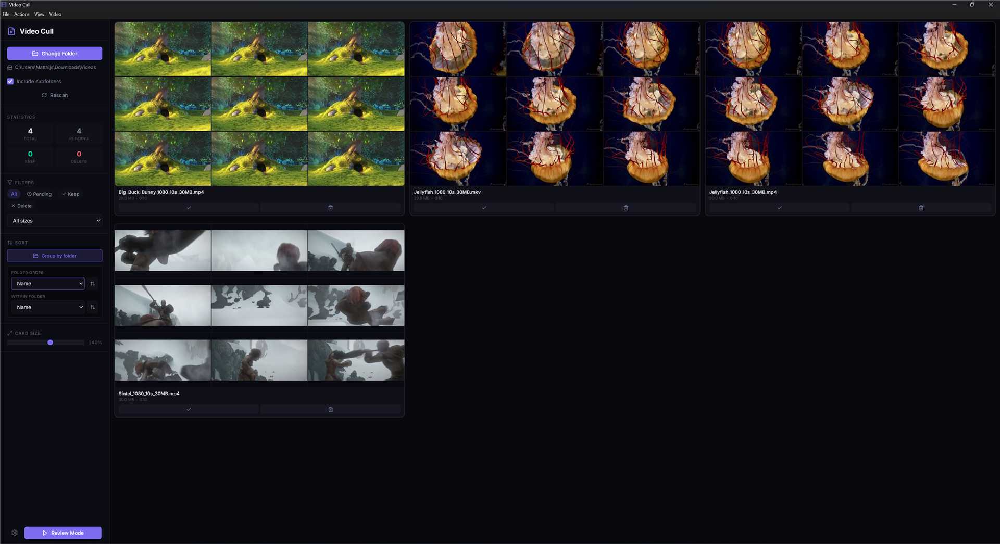
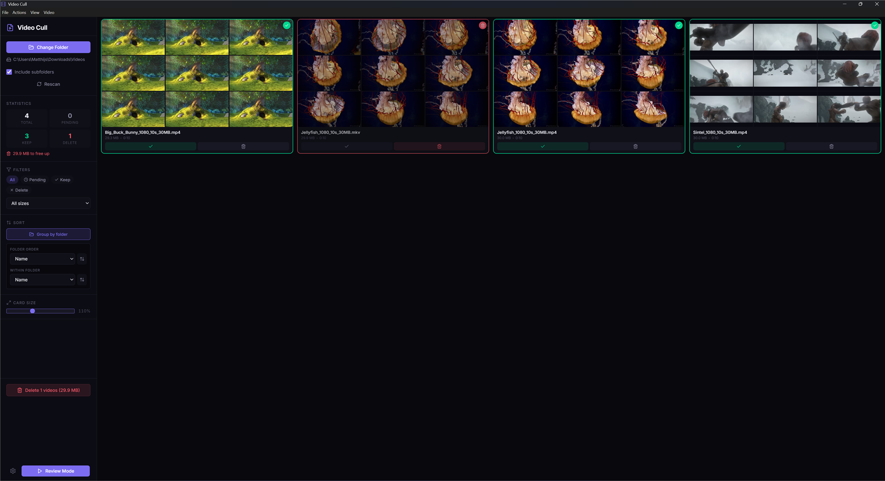
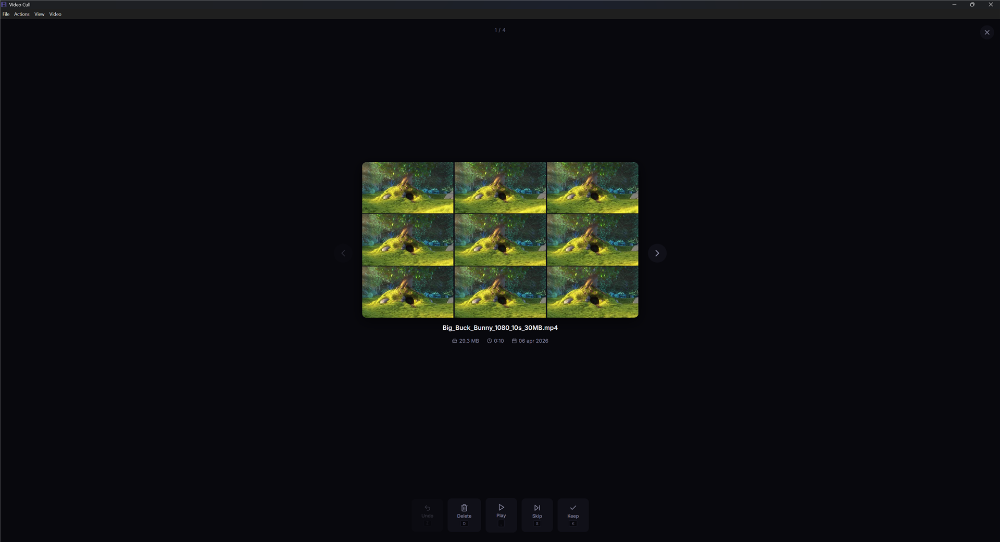
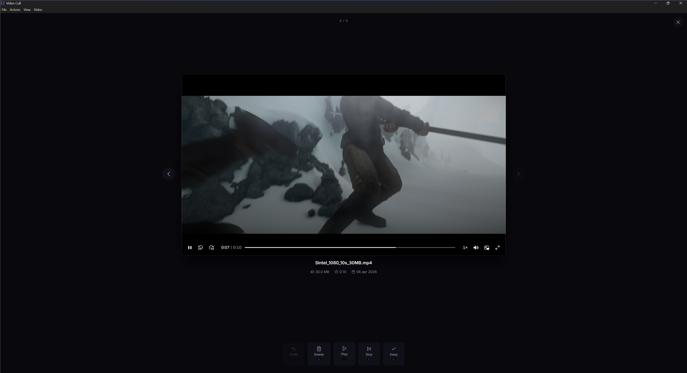
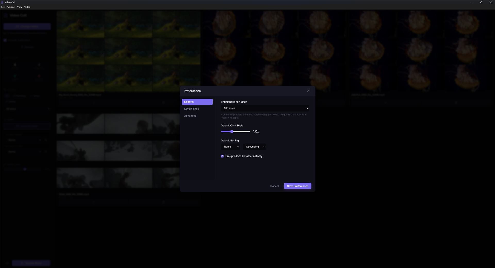
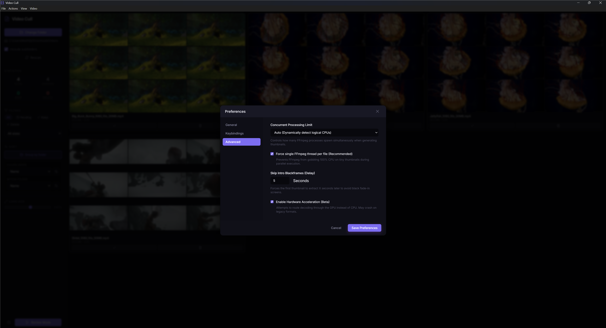

# Video Cull

> Tear through a massive video library in minutes. No cloud. No account. Just you, your files, and a keyboard.

You've got a folder full of videos — dashcam clips, downloaded channels, drone footage, years of random stuff you never got around to sorting. Opening each one in VLC is not a workflow. Video Cull is.

Point it at a folder. It scans everything, generates thumbnail strips for every video, and gives you a fast, keyboard-driven interface to decide what stays and what goes. When thumbnails aren't enough, hit play and scrub through it right there. Mark, move on, repeat.

When you're done, one command sends everything marked for deletion to the Recycle Bin. Nothing is permanently gone until you say so.

---

## Screenshots

<table>
<tr>
  <td></td>
  <td></td>
</tr>
<tr>
  <td></td>
  <td></td>
</tr>
<tr>
  <td></td>
  <td></td>
</tr>
<tr>
  <td colspan="2" align="center"></td>
</tr>
</table>

---

## Download

Grab the latest installer from the [Releases](https://github.com/stippie-dot/VideoCurl/releases) page.

Installs for the current user — no admin rights needed. On first launch Windows may show a SmartScreen prompt since the app isn't code-signed yet; click "Run anyway" to proceed.

---

## Features

### Grid View

The main screen shows your entire library at a glance — every video represented by a strip of thumbnails pulled from different points in the file, so you know what you're looking at without opening anything.

- Adjustable card size (zoom in/out with `Ctrl++` / `Ctrl+-`)
- Group videos by subfolder, with per-folder totals
- Filter by status (All / Pending / Keep / Delete)
- Filter by file size (50 MB+, 100 MB+, 500 MB+, 1 GB+)
- Sort by name, size, duration, or date — ascending or descending
- Quick inline preview for supported formats, external player for everything else

### Review Mode

A fullscreen, one-at-a-time view for when you actually want to pay attention. Keyboard only. Make a call, move to the next one.

- Thumbnail strip with dynamic aspect ratio — no black bars, no guessing
- In-app video player with scrubbing support
- Metadata at a glance: filename, filesize, duration, date
- Undo any decision at any time before you commit the batch delete
- **Bookmarks** — press `B` while playing to drop a timestamped bookmark; bookmarks persist across sessions and appear as clickable chips below the player
- **Playback speed** — `[` / `]` to step through 0.5×, 0.75×, 1×, 1.25×, 1.5×, 2×; speed persists as you move between videos

### Thumbnail Generation

Video Cull uses FFmpeg in the background to extract frames. A few things worth knowing:

- **Configurable frame count** — 1, 2, 4, 6, or 9 thumbnails per video (default: 6)
- **Intro skip** — first frame is offset by a configurable delay (default: 3 seconds) to avoid black fades
- **Parallel processing** — configurable concurrency: auto-detect, or set manually from 1 to 8 threads
- **Cached** — thumbnails are stored in a hidden `.video-cull-thumbs` folder next to your media; already-processed videos are skipped on rescan
- **Hardware acceleration** — optional GPU-assisted decoding (beta, may not work with all formats)

### Cache & Progress

Progress is saved in a `.video-cull-cache.json` file inside the scanned folder. Plug that drive into another machine with Video Cull installed — your keep/delete decisions are still there.

---

## Keyboard Shortcuts

### Grid & General

| Shortcut | Action |
|----------|--------|
| `Ctrl + O` | Open directory |
| `F5` | Rescan directory |
| `Ctrl + Z` | Undo last action |
| `Ctrl + Backspace` | Send all marked videos to Recycle Bin |
| `Ctrl + Shift + R` | Clear thumbnail cache |
| `Ctrl + E` | Reveal file in Explorer |
| `Ctrl + +` / `Ctrl + -` | Zoom cards in/out |
| `F11` | Toggle fullscreen |
| `?` | Open keyboard shortcuts reference |

### Review Mode

| Shortcut | Action |
|----------|--------|
| `K` | Keep |
| `D` | Mark for deletion |
| `S` | Skip (leave status unchanged) |
| `Z` | Undo |
| `Space` | Play / pause |
| `← / →` | Previous / next video (or scrub 5s when playing) |
| `Enter` | Play in-app |
| `Ctrl + Enter` | Open in external player |
| `B` | Drop bookmark at current position |
| `[` / `]` | Decrease / increase playback speed |
| `Esc` | Stop playback / exit review |

All review shortcuts are fully customizable in Settings.

---

## Settings

| Setting | Options | Default |
|---------|---------|---------|
| Thumbnails per video | 1, 2, 4, 6, 9 | 6 |
| Default card scale | 0.5× – 2.0× | 1.0× |
| Default sort | Name / Size / Date / Duration | Name |
| Group by folder | On / Off | On |
| Concurrent processing | Auto / 1 / 2 / 3 / 4 / 8 | Auto |
| Limit FFmpeg to 1 thread per file | On / Off | On |
| Intro skip delay | 0 – 60 seconds | 3s |
| Hardware acceleration | On / Off | On |
| Keybindings | Any single key | K / D / S / Z / Space |

---

## Supported Formats

Plays natively in-app: `.mp4` `.webm` `.mov` `.mkv` `.m4v`

All other formats (`.avi`, `.wmv`, `.flv`, `.ts`, `.mts`, etc.) open automatically in your default system player. FFmpeg generates thumbnails for anything it can decode — which is basically everything.

---

## Building from Source

Requires Node.js 18+. FFmpeg and FFprobe are bundled — no separate install needed.

```bash
git clone https://github.com/stippie-dot/videocurl.git
cd videocurl
npm install
npm run dev
```

### Available Scripts

<!-- AUTO-GENERATED from package.json scripts -->
| Command | Description |
|---------|-------------|
| `npm run dev` | Start Vite + Electron in development mode with hot reload |
| `npm run build` | Vite-only production build (renderer only, no packaging) |
| `npm run package` | Full production build + Windows installer (NSIS) |
<!-- END AUTO-GENERATED -->

To build the Windows installer yourself:

```bash
npm run package
```

---

## Stack

[Electron](https://www.electronjs.org/) · [React](https://react.dev/) · [Video.js](https://videojs.com/) · [FFmpeg](https://ffmpeg.org/) · [Zustand](https://github.com/pmndrs/zustand) · [TypeScript](https://www.typescriptlang.org/) · [Vite](https://vitejs.dev/)

---

## License

[GNU General Public License v3.0](LICENSE)
